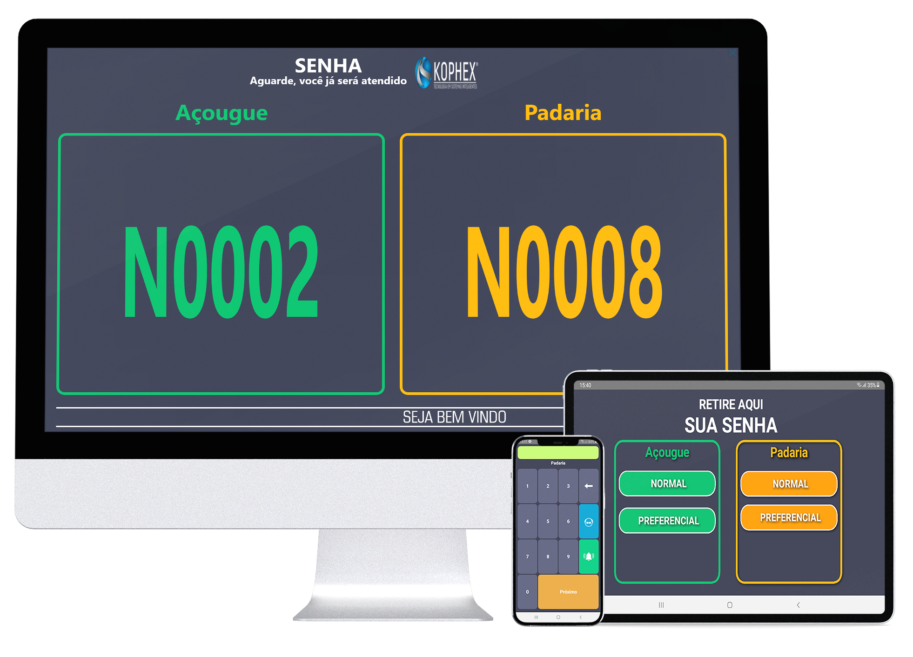
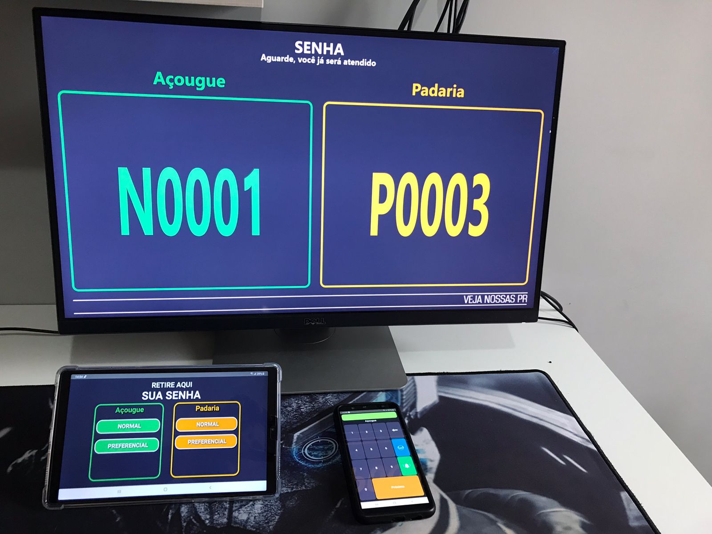
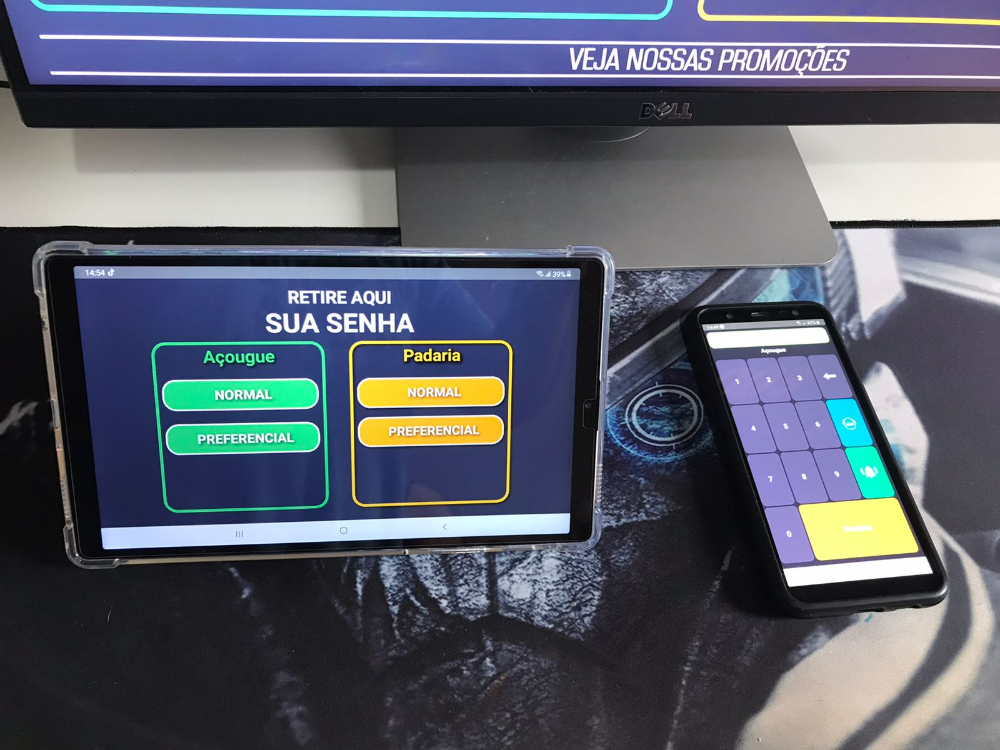
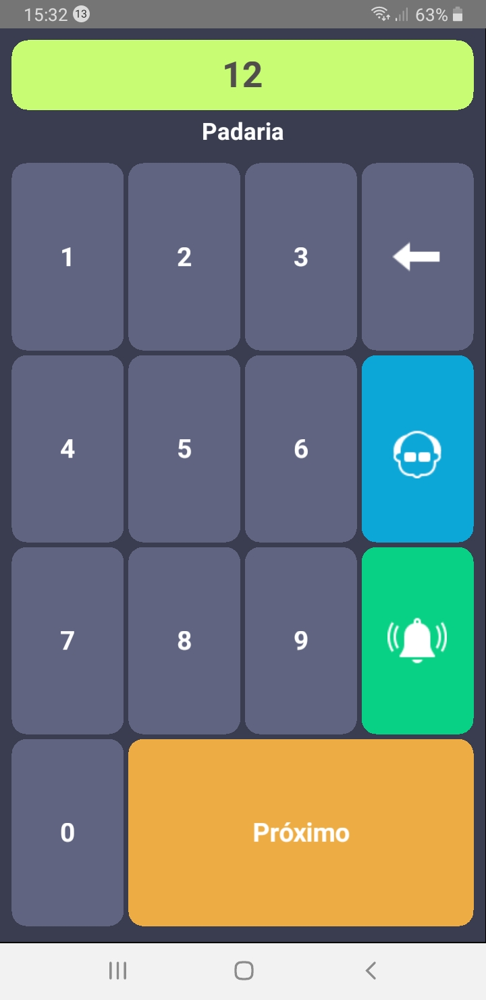
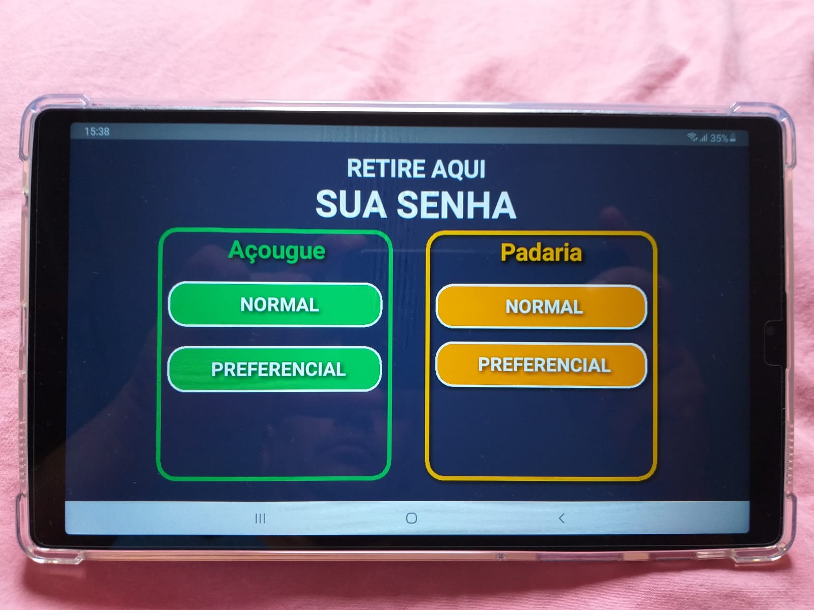
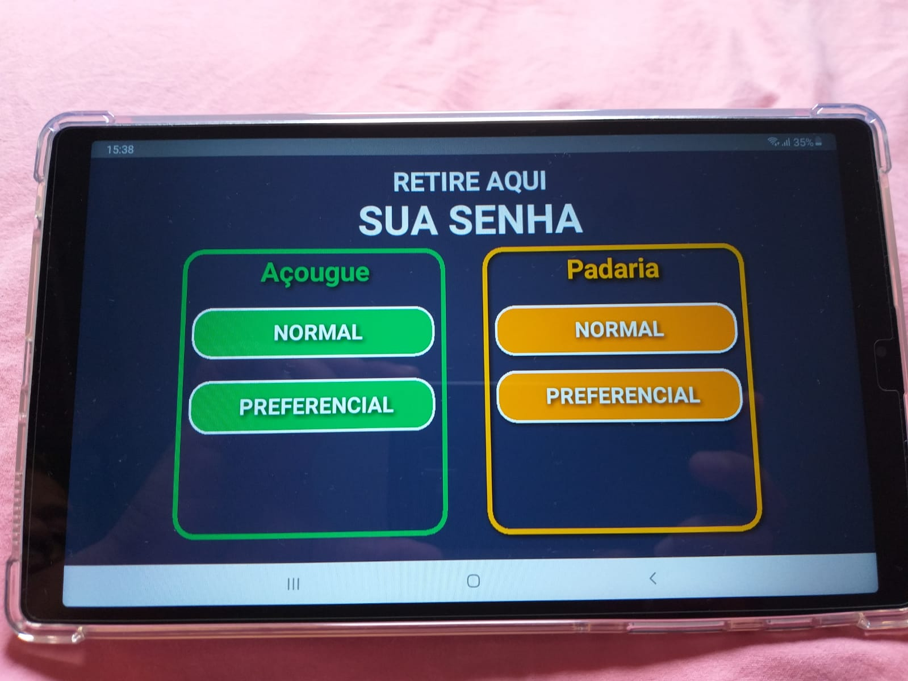
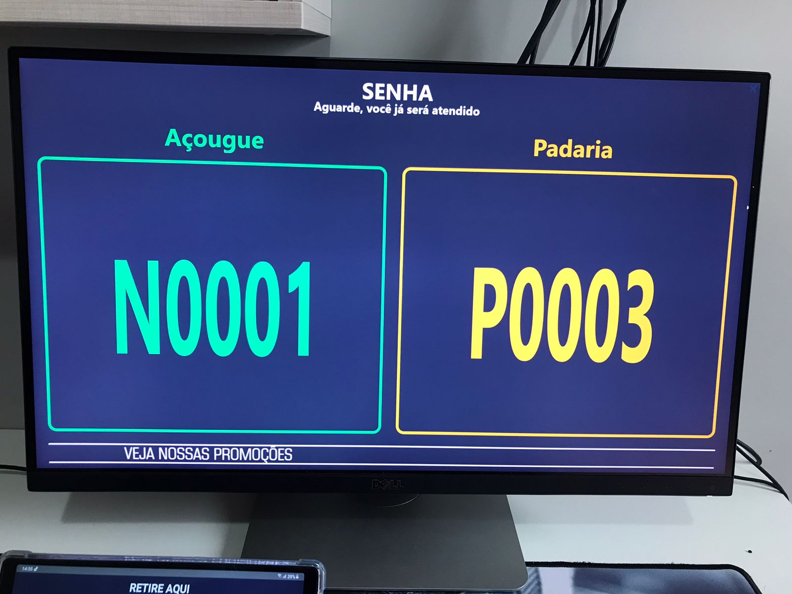
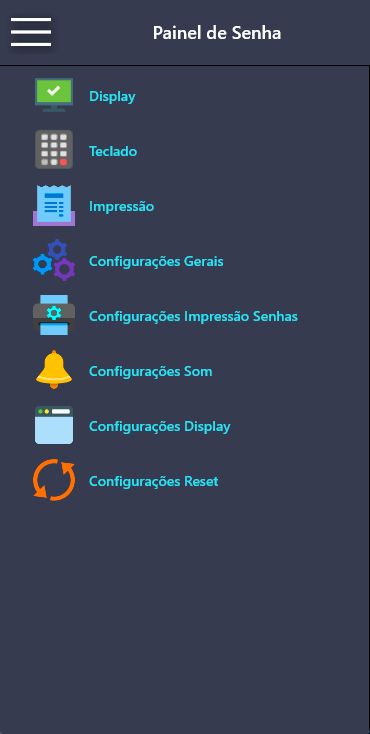

# Painel de Chamada de Senhas — Delphi FireMonkey

Sistema de painel para chamada e gerenciamento de senhas, desenvolvido em Delphi com FireMonkey.

## Recursos

- Personalização dos nomes exibidos no painel e nos demais módulos
- Atendimento de um ou dois setores simultaneamente
- Letreiro digital personalizável
- Senhas normais e preferenciais
- Aviso sonoro de chamada
- Segunda chamada da senha
- Chamada automática da próxima senha ou digitação manual
- Etiquetas de chamada personalizadas
- Aplicação de painel, módulo de atendimento e servidor

## Aplicações

O sistema pode ser adaptado para bancos, cartórios, supermercados, açougues, padarias, fast-foods, hospitais, clínicas e outros estabelecimentos que trabalham com filas e chamadas de senhas.

## Tecnologias

- Delphi
- FireMonkey (FMX)
- DataSnap / REST
- Aplicações para Windows e Android

## Demonstração

## Configuração

Antes de executar, revise os endereços do servidor e os caminhos locais configurados nos arquivos JSON e nos formulários do projeto para adequá-los ao seu ambiente.

## Observação

Projeto independente para estudo, personalização e evolução pela comunidade. Delphi e FireMonkey são marcas de seus respectivos proprietários.
